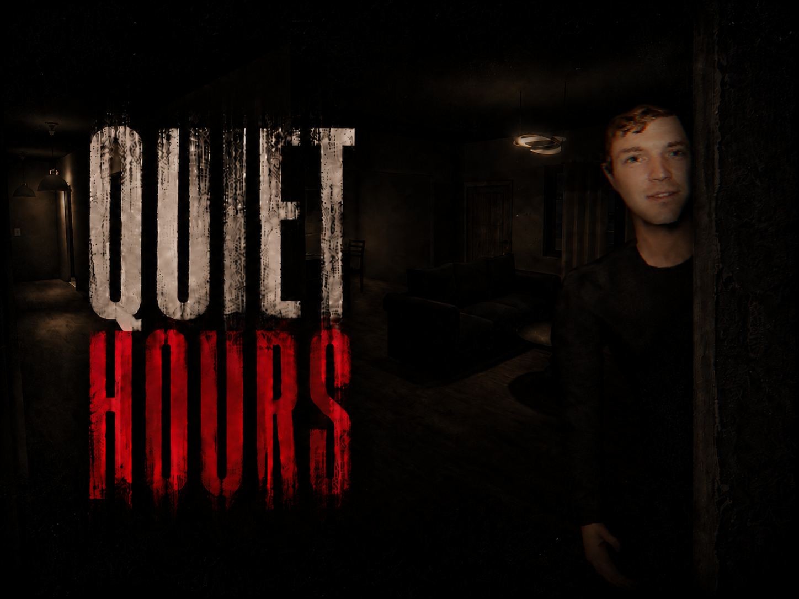

# Quiet Hours

### Made by João Afonso

> **Em desenvolvimento.** Ainda não há build para jogar.

Jogo de terror narrativo na primeira pessoa, feito em Unity. Tomás, 22 anos,
aluga o quarto barato de um apartamento partilhado. Rui, o colega de casa que o
escolheu, subarrenda o quarto sem o senhorio saber e continua a ter uma cópia da
chave.

Três dias no mesmo apartamento, sem combate e com três finais. A história passa
pelo telemóvel do Tomás, pelas coisas que não estão onde as deixou e por uma
porta de quarto que, aos poucos, deixa de o proteger.

Mais sobre o projeto no [portfolio](https://joaoafonso.vercel.app/work/quiet-hours).

## Estado

Já se joga o prólogo — a chegada de elevador, o primeiro encontro com o Rui e a
primeira noite — e parte do primeiro dia. O resto da história está escrito e por
construir: os dias dois e três, o clímax e os três finais.

## Como está feito

Unity **2022.3.62f3**, URP 14 e o Input System novo. Todo o código do jogo está
em [`Assets/Pungent/Scripts/`](Assets/Pungent/Scripts): cerca de 160 scripts de
jogo e 90 ferramentas de editor que montam e ligam as cenas por código.

| Sistema | O que faz |
|---|---|
| `Narrative` | Dias e capítulos, objetivos, o estado partilhado da história (`NarrativeBlackboard`) e os beats do prólogo e do primeiro dia. |
| `Interaction` | Portas que se arrastam, o frigorífico, a fechadura que prende (`StickyLock`), esconderijos e o telemóvel com conversas (`PhoneMessageService`). |
| `NPC` | A rotina do Rui, a cabeça que segue o jogador, o território do quarto dele e a presença sonora pela casa. |
| `Dialogue` | Falas e escolhas no mundo, e os pensamentos do Tomás. |
| `Atmosphere` | Luz instável, ecrãs da televisão e do portátil, pó volumétrico e o filtro VHS em URP. |
| `Audio` | Passos, tom de sala procedural e som abafado pelas paredes. |
| `Player` | Controlador na primeira pessoa e física de câmara. |
| `Menu` | Menu principal, pausa e definições. |
| `Driving` | A sequência de condução noturna, cortada da versão atual. |

## Abrir o projeto

1. Instala o Unity **2022.3.62f3**.
2. Clona o repositório e abre a pasta no Unity Hub.
3. Abre `Assets/Scenes/Apartment_Reboot.unity`.

**Os assets de terceiros não estão incluídos**, por licença e por tamanho. O
código compila, mas as cenas abrem com modelos, texturas, animações e sons em
falta, e o menu principal sem a arte. O jogo usa:

- Quaternius Ultimate House Interior (CC0)
- Texturas [Poly Haven](https://polyhaven.com/textures) (CC0)
- Áudio de Kenney, laleksic e LEGIT (CC0)
- Animações [Mixamo](https://www.mixamo.com)
- Packs de terceiros de ambientes urbanos, veículos, adereços e céus

O filtro VHS ([`VHS_URP.shader`](Assets/Pungent/Shaders/VHS_URP.shader)) é uma
adaptação para URP do `VHS_Mobile.shader` dos ficheiros de tutorial em
[BATPANn/Fears_To_Fathom](https://github.com/BATPANn/Fears_To_Fathom).
